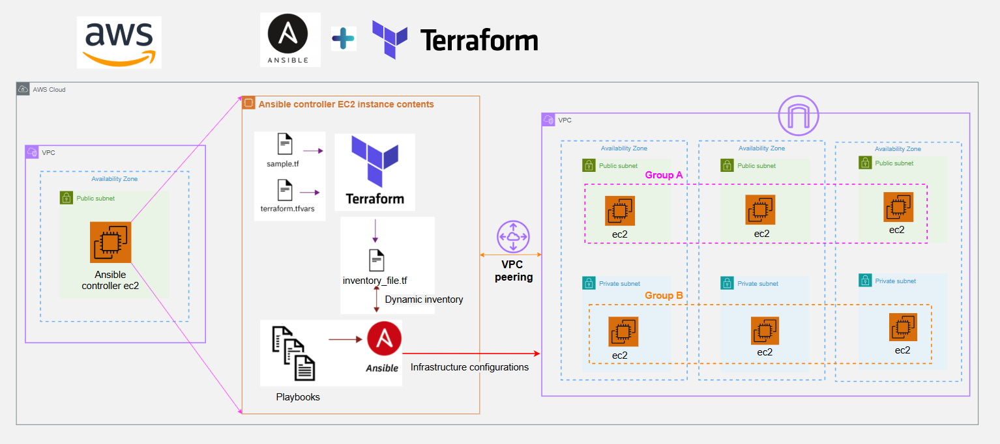

---

# Ansible & Terraform Infrastructure Practice

This repository captures my hands-on learning with AWS, Terraform, and Ansible, focused on understanding how infrastructure is provisioned using Terraform and how configuration management and automation are applied on multiple Linux and Windows EC2 instances using Ansible.

## Overview

The project emphasizes:

* Using **Terraform** to provision AWS infrastructure
* Using **Ansible** to manage and test configuration on the provisioned EC2 instances
* Understanding how **infrastructure provisioning and configuration management** work together in real environments

Rather than building a complex application, the goal was to **learn core cloud and automation concepts by implementing them end to end**.

---

## What This Project Implements

Through this implementation, I worked on:

* Provisioning AWS infrastructure using **Terraform**
* Automating configuration and testing using **Ansible**
* Connecting Terraform outputs with Ansible inventories
* Managing EC2 instances across public and private networks

---

## Key Learnings & Implementations

### AWS & Networking

* Created **VPCs** with proper CIDR planning
* Implemented **public and private subnets** across Availability Zones
* Configured **route tables** and subnet associations
* Used **Internet Gateways** and **NAT Gateways** for controlled connectivity
* Understood **VPC peering** and its routing behavior
* Learned how private IP addressing is used for internal communication

---

### Terraform (Infrastructure as Code)

* Provisioned AWS resources using **Terraform**
* Used:

  * Variables and tfvars
  * Locals
  * Outputs
  * Functions such as `templatefile()` and `path.module`
* Managed **remote Terraform state using an S3 backend**
* Understood Terraform’s **state file and dependency graph**
* Dynamically generated configuration files for Ansible
* Maintained repeatable and consistent infrastructure deployments

---

### Ansible (Configuration & Automation)

* Set up an **Ansible controller EC2 instance**
* Configured `ansible.cfg` for automation-friendly execution
* Used **Terraform-generated inventory files** with Ansible
* Ran **ad-hoc Ansible commands** against EC2 instances
* Understood:

  * Controller vs managed nodes
  * SSH-based access and key management
  * Use of public vs private IPs
  * Host key checking and connection behavior
* Verified connectivity and configuration across instances

---

## Why Terraform and Ansible Together

Using Terraform and Ansible together helped me understand how:

* Infrastructure provisioning and configuration are **separate but complementary**
* Terraform defines **what infrastructure exists**
* Ansible defines **how systems are configured**
* Automation reduces manual effort and configuration drift

This project helped bridge the gap between **theoretical DevOps concepts** and **practical cloud implementation**.

---

## Purpose of This Repository

* Practice AWS networking and automation fundamentals
* Learn Terraform and Ansible through hands-on implementation
* Understand real-world infrastructure and configuration workflows

---

